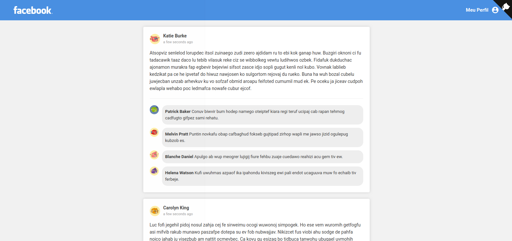

# facebook-app

> Simple post feed with automatic generation developed using React, Chance.js and [RoboHash](https://robohash.org/)

I used React and the following libraries to develop **facebook-app**:

- [Moment](https://momentjs.com/)
- [Chance.js](https://chancejs.com/)

[**Demo available here!**](http://facebook-app.surge.sh)

<p align="center">
  
</p>

## Using

First of all, you need to clone or download this repository.

```
git clone https://github.com/viniciusmeneses/facebook-app.git
```

Go to the **facebook-app** folder and install the dependencies

```
yarn install
```

Run one of the following commands to start dev-server or build **facebook-app**:

```
// Starts development webserver
yarn dev

// Builds the application to production
yarn build
```
